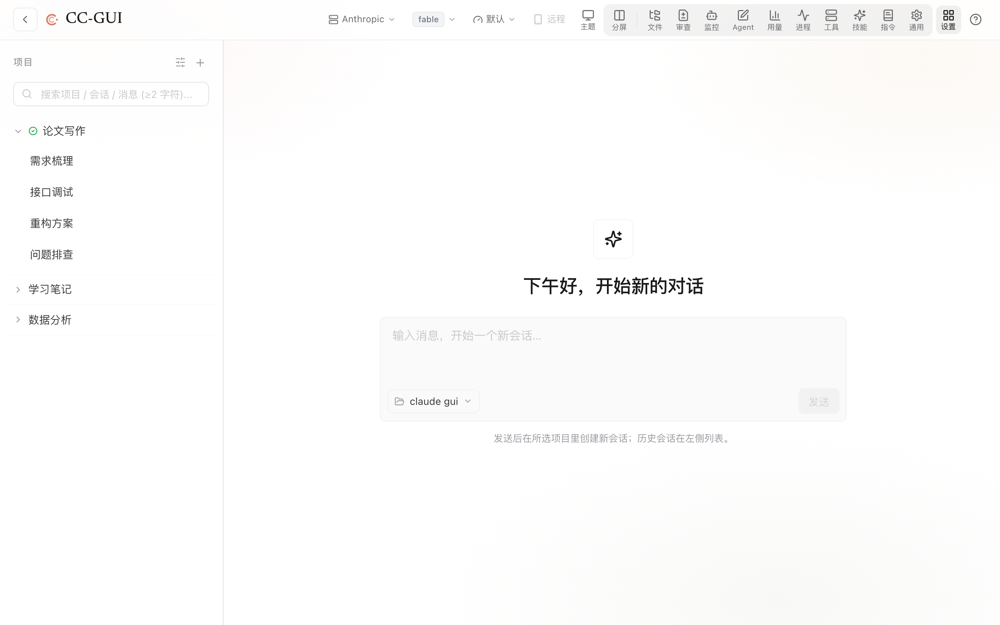

# CC-GUI

English | [中文（主文档）](README.md)

CC-GUI is a local graphical shell for the [Claude Code](https://docs.anthropic.com/en/docs/claude-code) CLI: a Tauri desktop app, a browser UI, and a mobile-friendly layout. Once running, you can browse and continue Claude Code sessions, send messages, compare panes side by side, and reach it from your phone over a private network such as Tailscale.

> Fully local — it collects no data; every session runs through the `claude` CLI on your own machine.

<p align="center">
  <br>
  <em>Main window: the top bar covers it all — model / thinking effort / permission mode / provider switching, plus panels for split-screen, files, review, monitoring, agents, usage, skills and MCP tools</em>
</p>

---

## Features

Everything the `claude` CLI can do, made visual — plus shell-only conveniences the terminal never had.

**Chat & sessions**
- Browse, resume, and start sessions with rich rendering (Markdown, LaTeX, syntax highlighting)
- **Split-screen** — run multiple sessions side by side, each with its own model / permission mode / thinking effort
- Collapsible tool-call cards (Bash, Read, Edit, Web, Task, Skill…) with diffs; subagent runs visualized
- **Plan-review & question cards** — approve plans or pick options graphically (`ExitPlanMode` / `AskUserQuestion`)
- `@` reference picker (insert a file, or pull another session's summary in), slash-command completion (built-in + project-level), input prediction, message queue / stop / recall, WeChat-style compact chat mode

**Models & providers**
- Switch model & thinking effort per pane; switch provider (official subscription + many third-party relays: DeepSeek, Qwen, Kimi, GLM, Grok, OpenAI-compatible, …)
- Manage custom providers (add/edit, fetch model list, test connection); 1M-context default; live context-usage badge

**Permissions & planning**
- Four permission modes (default / acceptEdits / plan / bypass), switchable mid-run; graphical permission cards; a permission-rules page

**MCP & plugins**
- Manage MCP servers (add, ping, OAuth login, enable/disable, edit) with **per-tool enable/disable + tool listing**
- One-click official plugin install (enable/disable/update/remove), auto-synced to your agents

**Skills**
- Skills marketplace (multiple sources) and import from any GitHub / Gitee repo; local add / archive / delete

**Files & code**
- File browser (browse / edit / delete-with-undo / open-with-default-app; **PDF & HTML preview**)
- Rollback & review (checkpoint snapshots, per-file or whole-session restore), diff viewer, uploads, Git integration, worktrees

**Sessions**
- Pinned / titled / archived session list, auto titles, session fork, targeted compaction & trim, per-turn spend cap

**Monitoring & usage**
- Monitor panel (in-turn Tasks / background tasks / background agents / `claude` processes), usage stats & `/insights` reports, process panel

**Remote**
- Reach it from your phone over a private network (Tailscale, etc.) with an access password; take over a session from your phone

**Updates & environment**
- GUI self-update with live progress; update / install / switch the Claude CLI from the GUI; environment checks (node / claude / python / uv / git)

**Look & feel**
- Guided tour, custom backgrounds & themes (light / dark and more), font scaling, prompt templates

---

## 1. Prerequisites (read first)

The GUI is only a shell around the `claude` CLI, so **install and sign into Claude Code first**:

1. Install the [Claude Code CLI](https://docs.anthropic.com/en/docs/claude-code/setup) so the `claude` command works in your terminal.
2. Run `claude` once and confirm it can chat (signed into a subscription, or with an API key configured).

Without this the GUI opens but cannot send messages.

---

## 2. Install (pick one)

### Option A: One-line npm install (best when GitHub is slow or blocked)

The installer bytes ship inside per-platform npm packages, so installing talks to **npm only — never GitHub**. Requires Node.js 20+.

```bash
npx @wsxwj123/cc-gui
```

One command downloads, installs and launches the app. `cc-gui` is an installer, not an everyday command — it only runs to install or upgrade — so npx is the recommended form: no global install, and it is unaffected by npm's global-directory permissions (with node from the official .pkg, `npm i -g` fails with `EACCES`; see the FAQ):

- **macOS (Apple Silicon)**: installs to `~/Applications/CC-GUI.app`. Files unpacked by npm carry no quarantine flag, so **no `xattr` step and no "damaged app" prompt**.
- **Windows (x64)**: silently runs the bundled official installer (per-user, no admin prompt), with a Start Menu entry and normal uninstall.

**Upgrade**: `npx @wsxwj123/cc-gui@latest` after fully quitting CC-GUI. It only ever moves forward — if the app's own updater already installed a newer build, the command just opens it instead of downgrading.

**Alternative: global install** (for node installed via Homebrew / nvm, whose global directory is user-owned and has no permission issue):

```bash
npm i -g @wsxwj123/cc-gui
cc-gui
```

Upgrade with `npm i -g @wsxwj123/cc-gui@latest`, quit the app, then run `cc-gui` again. Do not use `sudo npm i -g`: it installs, but leaves `~/.npm` cache files owned by root, and later npm commands start failing with new permission errors.

**Uninstall** takes two steps; the first alone leaves the app installed (npx users have no global package — skip straight to step 2).

**Step 1 — remove the npm package** (launcher + installer bytes, platform package included):

```bash
npm rm -g @wsxwj123/cc-gui
```

**Step 2 — remove the app itself.** The npm package is only an installer, so removing it does not touch an already-installed app:

- **macOS**: fully quit CC-GUI (Cmd+Q), then move `~/Applications/CC-GUI.app` to the Trash.
- **Windows**: Settings → Apps → Installed apps → **CC-GUI** → Uninstall (or run the uninstaller in `%LOCALAPPDATA%\CC-GUI`).

Your data is kept either way:

| Directory | What it is | On uninstall |
|---|---|---|
| `~/.claude-gui/` (Windows: `%USERPROFILE%\.claude-gui`) | CC-GUI's own config (providers, skins, network settings) | Delete it if you want a clean slate |
| `~/.claude/` | **The Claude Code CLI's own directory** (session history, skills, settings) | **Leave it alone** — deleting it breaks `claude` in your terminal too |

Other platforms are not supported yet and say so explicitly.

### Option B: Download an installer (easiest)

Grab your platform from the [Releases page](https://github.com/wsxwj123/claude-gui/releases/latest):

| Platform | File |
|---|---|
| Windows (installer) | `CC-GUI_*_x64-setup.exe` |
| Windows (MSI) | `CC-GUI_*_x64_en-US.msi` |
| macOS (Apple Silicon) | `CC-GUI_*_aarch64.dmg` |

> Packages are unsigned / un-notarized:
> - **macOS**: right-click the app → **Open** the first time to bypass Gatekeeper (Apple Silicon only; for Intel Macs build with the `x86_64-apple-darwin` target yourself).
> - **Windows**: on the SmartScreen prompt click **More info → Run anyway**.

### Option C: Run from source (latest features)

**1. Install tooling**

- [Node.js](https://nodejs.org) 20 or newer (includes npm)
- Only needed to *package the desktop app*: Rust stable + [Tauri platform deps](https://v2.tauri.app/start/prerequisites/)

**2. Clone**

```bash
git clone https://github.com/wsxwj123/claude-gui.git
cd claude-gui
```

**3. Start it (first run auto-installs deps & builds)**

**Double-click the launcher** — the first run auto-installs dependencies, builds the frontend (a few minutes), then opens your browser at `http://localhost:6677` (close the window to stop):

- **macOS**: double-click `gui.command` (if blocked, right-click → **Open** once)
- **Windows**: double-click `gui.bat`

Or do it manually from the command line:

```bash
npm install                  # root deps
npm --prefix client install  # frontend deps
npm run build                # build the frontend
npm start                    # start the server, port 6677 by default
```

Then open **http://localhost:6677**.

---

## 3. Use it from your phone

1. Run the GUI on your computer (Option C).
2. Join the machine to your private network with [Tailscale](https://tailscale.com) (or similar).
3. On your phone, open `http://<computer-tailscale-address>:6677`.
4. Use the browser's "Add to Home Screen" for a near-native, full-screen experience.

> ⚠️ Use it **only over a private network** and set your own access password. **Never** expose a Claude Code control surface directly to the public internet.

---

## 4. Build a desktop app (optional)

```bash
npm run tauri:build
```

Output lands in `src-tauri/target/release/bundle/` (`.dmg` on macOS, `.exe` / `.msi` on Windows). For interactive desktop development use `npm run tauri:dev`.

---

## 5. Troubleshooting

| Symptom | Fix |
|---|---|
| Port 6677 in use | `npm run stop` to free the port, or close whatever is using it |
| Build fails with `Cannot find native binding` / `different Team IDs` | Your `node` is likely an app-bundled one on PATH (macOS library validation rejects third-party native modules). Use an official/Homebrew/nvm node: `brew install node` or [nodejs.org](https://nodejs.org), confirm `which node` is not inside a `.app`, delete `node_modules` and `client/node_modules`, then retry |
| Blank page / can't send | Confirm the `claude` CLI works and Node ≥ 20; delete `client/dist` and `npm run build` again |
| Code changes not showing | From source you must `npm run build` again (or re-launch `gui.command` / `gui.bat`) |
| macOS `gui.command` does nothing | Right-click → **Open** once to authorize, or `chmod +x gui.command` |
| **macOS says "CC-GUI.app is damaged and can't be opened"** (and Privacy & Security has no **Open Anyway** button — common on macOS 15+) | Not actually damaged — Gatekeeper added a quarantine flag to the unsigned app. In Terminal (no sudo needed): `/usr/bin/xattr -dr com.apple.quarantine "/Applications/CC-GUI.app"`, then double-click again |
| **`.dmg` won't mount, says "damaged"** (rare; more likely when the file arrived over a non-browser channel) | Clear quarantine on the dmg itself (adjust the path; no sudo needed): `/usr/bin/xattr -dr com.apple.quarantine ~/Downloads/CC-GUI_*.dmg`, then double-click to mount |
| `xattr` says `option -r not recognized` | A Python `xattr` (from pyenv / conda) shadows the system one on PATH. Use the absolute path `/usr/bin/xattr -dr ...` |
| `npm i -g` fails with `EACCES: permission denied` | With node from the official .pkg installer, the global directory `/usr/local/lib/node_modules` is root-owned — every global install fails this way; it is not specific to this project. Either ① use `npx @wsxwj123/cc-gui` (recommended, zero setup), or ② move the npm prefix: `npm config set prefix ~/.npm-global` and add `~/.npm-global/bin` to PATH. Do not use `sudo npm i -g`: it installs, but leaves `~/.npm` cache files owned by root, so later npm commands fail with new permission errors |
| Install fails with "platform package not found" | Registry mirrors sync on demand, so a fresh release's platform packages may lag or be missing entirely. Install once from the official registry: `npx --registry=https://registry.npmjs.org @wsxwj123/cc-gui@latest`, or use Option B |
| `cc-gui` collides with another command | Use `npx @wsxwj123/cc-gui` — identical behaviour |

---

## Acknowledgments

- **[cc-switch](https://github.com/farion1231/cc-switch)** by [farion1231](https://github.com/farion1231) — an excellent multi-provider configuration manager for Claude Code. CC-GUI's one-click "import from cc-switch" integrates with it, and its provider management influenced our design. Thank you!

---

## License

MIT. See [LICENSE](LICENSE).
