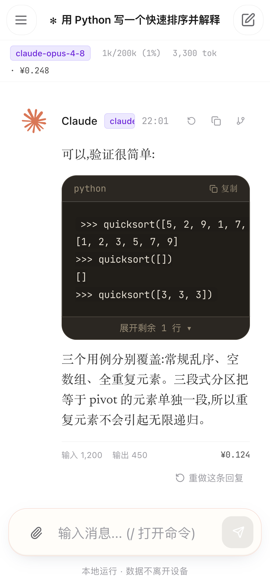
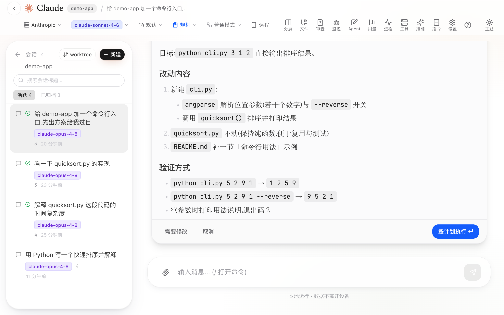
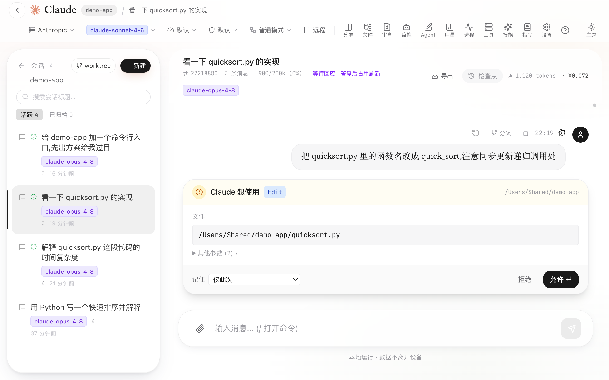

<!-- 待补 2 张手拍图:docs/screenshots/01-hero-split.png(分屏+右侧流式中)、docs/screenshots/05-monitor.png(子代理运行中的监控面板)。拍法见 .devflow/screenshot-guide.md;拍好前不要推送。 -->
# Claude GUI

<p align="center">
  <a href="LICENSE"></a>
  <a href="https://github.com/wsxwj123/claude-gui/releases/latest"></a>
  
  <a href="https://github.com/wsxwj123/claude-gui/stargazers"></a>
</p>

<p align="center"><a href="README.en.md">English</a> | 中文</p>

**Claude GUI 是 [Claude Code](https://docs.anthropic.com/en/docs/claude-code) CLI 的本地图形外壳**:一个 Tauri 桌面应用 + 浏览器界面 + 手机友好布局。浏览并续接会话、分屏对比、图形化批准权限与计划,还能经 Tailscale 等私有网络在手机上接管正在跑的会话。

> **English**: Claude GUI is a fully local graphical shell for the Claude Code CLI — a Tauri desktop app, a browser UI, and a mobile-friendly layout. Zero telemetry: every session runs through the `claude` CLI on your own machine. Split-screen sessions with per-pane model/permission, third-party provider switching, graphical permission & plan-review cards, subagent visualization, skills marketplace, and phone takeover over a private network.

<table>
  <tr>
    <td align="center" width="62%">
      <br>
      <em>分屏两会话并行:左右窗格各自独立的模型 / 权限模式 / 思考强度,一侧正在流式输出</em>
    </td>
    <td align="center" width="38%">
      <br>
      <em>手机端布局:私有网络访问,随时接管电脑上正在跑的会话</em>
    </td>
  </tr>
</table>

---

## 为什么是 Claude GUI

- **纯本地、零遥测** —— 不收集任何数据,所有会话都走你自己机器上的 `claude` 进程,没有云、没有账号、没有中间人
- **分屏多会话** —— 多窗格并排,每个窗格独立的模型 / 权限模式 / 思考强度
- **任意 Provider** —— 官方订阅 + DeepSeek、通义 Qwen、Kimi、GLM、Grok、OpenAI 兼容等第三方中转一键切换
- **图形化权限与计划审查** —— 权限请求、`ExitPlanMode` 计划卡、`AskUserQuestion` 选项卡全部可视化批准
- **子代理与后台任务可视化** —— Task 子代理运行流、后台任务、`claude` 进程一屏监控
- **技能与插件生态** —— 多源技能市场、从任意 GitHub/Gitee 仓库导入、MCP 管理精确到单工具
- **手机也能用** —— 私有网络 + 访问密码,浏览器加到主屏幕即近原生体验

---

## 功能一览

`claude` CLI 能做的都做成可视化,再加上终端天生没有的外壳体验。

**对话与会话**
- 浏览、续接、新建会话,富文本渲染(Markdown / LaTeX / 代码高亮)
- **分屏对比** —— 多窗格并排跑不同会话,各自独立模型 / 权限模式 / 思考强度
- 工具调用卡片(Bash / Read / Edit / Web / Task / Skill,可折叠带 diff)、子代理运行可视化
- **计划审查卡 & 问题选择卡** —— 图形化批准计划、选择选项(`ExitPlanMode` / `AskUserQuestion`)
- `@` 引用选择器(插入文件,或把别的会话摘要引进来)、斜杠命令补全(内置 + 项目级)、输入预测、消息排队 / 停止 / 召回、微信式紧凑聊天模式

<p align="center">
  <br>
  <em>计划审查卡:模型在 plan 模式下产出的计划,图形化过目后一键批准或驳回</em>
</p>

**模型与 Provider**
- 每窗格独立切换模型与思考强度;切换 Provider(官方订阅 + 大量第三方中转:DeepSeek、通义 Qwen、Kimi、GLM、Grok、OpenAI 兼容等)
- 自定义 Provider 增删改(拉取模型列表、测连接);1M 上下文默认;上下文占用徽章实时显示

<p align="center">
  <br>
  <em>Provider 切换:官方与 DeepSeek、Kimi 等第三方中转一键切换,自定义 Provider 可增删改、拉取模型列表</em>
</p>

**权限与规划**
- 四档权限模式(default / acceptEdits / plan / bypass)可中途切换;图形化权限弹卡;权限规则页

<p align="center">
  <br>
  <em>权限批准卡:每一次写操作 / 命令执行都弹卡说明,允许或拒绝由你点</em>
</p>

**MCP 与插件**
- MCP 服务器管理(增删、连通性测试、OAuth 登录、启停、编辑)+ **单工具级启用 / 禁用 + 查看工具列表**
- 官方插件一键安装(启停 / 更新 / 删除),自动同步进所有 agent

**技能(Skills)**
- 技能市场(多源)+ 从任意 GitHub / Gitee 仓库导入;本机技能添加 / 归档 / 删除

**文件与代码**
- 文件浏览器(浏览 / 编辑 / 删除可撤销 / 用默认 App 打开;**PDF、HTML 预览**)
- 回滚与审查(checkpoint 快照、按文件或整会话还原)、Diff 查看、上传、Git 集成、Worktree

**会话管理**
- 会话列表(置顶 / 自定义标题 / 归档)、自动标题、会话分叉、定向压缩与 trim、单轮花费上限

**监控与用量**
- 监控面板(当前对话 Task / 后台任务 / 后台代理 / claude 子进程)、用量统计与 `/insights` 报告、进程面板

<p align="center">
  <br>
  <em>监控面板:子代理、后台任务与 claude 进程的运行状态一屏看全</em>
</p>

**远程访问**
- 经私有网络(Tailscale 等)用手机访问,需访问密码;手机端接管某个会话

**更新与环境**
- GUI 自更新(实时进度);GUI 内更新 / 安装 / 切换 Claude CLI;环境检查(node / claude / python / uv / git)

**界面体验**
- 使用指引浮层、自定义背景与主题(深浅色及更多)、字体缩放、Prompt 模板

---

## 一、前置要求(必看)

GUI 只是 `claude` CLI 的外壳,**必须先装好并登录 Claude Code**:

1. 安装 [Claude Code CLI](https://docs.anthropic.com/en/docs/claude-code/setup),确保终端里 `claude` 命令可用。
2. 终端跑一次 `claude`,确认能正常对话(已登录订阅或配好 API Key)。

没有这一步,GUI 打开后无法发消息。

---

## 二、安装使用(两种方式,任选其一)

### 方式 A:下载安装包(开箱即用)

到 [Releases 页面](https://github.com/wsxwj123/claude-gui/releases/latest) 下载对应平台:

| 平台 | 文件 |
|---|---|
| Windows 安装程序 | `Claude GUI_*_x64-setup.exe` |
| Windows MSI | `Claude GUI_*_x64_en-US.msi` |
| macOS(Apple Silicon) | `Claude GUI_*_aarch64.dmg` |

> 安装包未签名 / 未公证:
> - **macOS**:首次打开「右键图标 → 打开」绕过 Gatekeeper(仅支持 Apple Silicon,Intel Mac 需自行用 `x86_64-apple-darwin` target 构建)。
> - **Windows**:弹 SmartScreen 时点「更多信息 → 仍要运行」。

### 方式 B:从源码运行(拿到最新功能,推荐)

**1. 装环境**

- [Node.js](https://nodejs.org) 20 或更高(自带 npm)
- 仅「打包桌面 App」才需要:Rust stable + [Tauri 各平台依赖](https://v2.tauri.app/start/prerequisites/)

**2. 克隆**

```bash
git clone https://github.com/wsxwj123/claude-gui.git
cd claude-gui
```

**3. 启动(首次自动装依赖并构建)**

**双击启动脚本**即可——首次会自动安装依赖、构建前端(约几分钟),随后打开浏览器到 `http://localhost:6677`(关掉窗口即停止):

- **macOS**:双击 `gui.command`(首次若被拦,「右键 → 打开」一次)
- **Windows**:双击 `gui.bat`

或者用命令行手动来一遍:

```bash
npm install                  # 根依赖
npm --prefix client install  # 前端依赖
npm run build                # 构建前端
npm start                    # 启动服务,默认 6677 端口
```

然后浏览器打开 **http://localhost:6677**。

---

## 三、在手机上使用

1. 在电脑上按「方式 B」把 GUI 跑起来。
2. 用 [Tailscale](https://tailscale.com)(或其他私有网络)把这台电脑接入你的私有网。
3. 手机浏览器打开 `http://<电脑的Tailscale地址>:6677`。
4. 用浏览器的「添加到主屏幕」,获得接近原生 App 的全屏体验。

> ⚠️ **只在私有网络里用**,并自行设置访问密码。**绝不要**把 Claude Code 控制面直接暴露到公网。

---

## 四、打包成桌面 App(可选)

```bash
npm run tauri:build
```

产物在 `src-tauri/target/release/bundle/`(macOS 的 `.dmg` / Windows 的 `.exe`、`.msi`)。交互式桌面开发用 `npm run tauri:dev`。

---

## 五、常见问题

| 现象 | 处理 |
|---|---|
| 端口 6677 被占用 | `npm run stop` 释放端口,或关掉占用它的进程 |
| 构建报 `Cannot find native binding` / `different Team IDs` | 你的 `node` 多半被某 App 自带的 node 抢了 PATH(带 macOS 库签名校验,拒绝第三方原生模块)。改用官方/Homebrew/nvm 的 node:`brew install node` 或 [nodejs.org](https://nodejs.org),确认 `which node` 不指向某个 `.app` 内部,删掉 `node_modules` 和 `client/node_modules` 后重试 |
| 打开白屏 / 发不了消息 | 确认 `claude` CLI 能用、Node ≥ 20;删掉 `client/dist` 后重新 `npm run build` |
| 改了代码不生效 | 源码方式下需重新 `npm run build`(或重新双击 `gui.command` / `gui.bat`) |
| macOS 双击 `gui.command` 没反应 | 「右键 → 打开」授权一次;或终端 `chmod +x gui.command` |
| **macOS 提示「Claude GUI.app 已损坏,无法打开」**(且「隐私与安全性」里没有「仍要打开」按钮,macOS 15 后常见) | 这不是真损坏,是 Gatekeeper 给未签名 app 加的 quarantine 标记。终端跑一次:`sudo xattr -rd com.apple.quarantine "/Applications/Claude GUI.app"` 输入登录密码后再双击即可 |

---

## 许可证

MIT,见 [LICENSE](LICENSE)。
